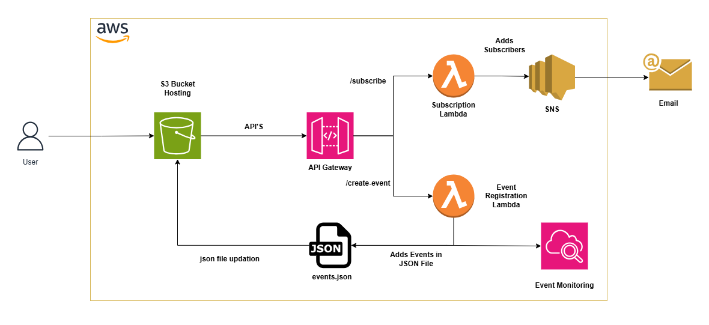

# 🤖 Serverless Event Management Platform on AWS

A serverless web application built on AWS that allows users to register for events through a static website. Submitted data is stored in Amazon S3, subscribers are added to Amazon SNS, and notifications are automatically sent using AWS Lambda.

---

## 📌 Project Overview

This project demonstrates how to build a fully serverless event registration platform using AWS services without managing any servers.

Users interact with a static website hosted on Amazon S3. When the contact form is submitted:

1. The event registration is stored in an S3 JSON file.
2. The user's email is subscribed to an SNS topic.
3. SNS sends email notifications.
4. Lambda handles all backend processing.

---

## 🏗️ Architecture

<p align="center">
  
</p>

---

## Architecture Flow

1. **User** accesses the static website hosted on **Amazon S3**.
2. The website sends HTTP requests to **Amazon API Gateway**.
3. API Gateway routes requests to the appropriate Lambda function:
   - **EventRegistrationLambda**
     - Stores event information in `events.json` within the S3 bucket.
     - Publishes a notification to an Amazon SNS topic.
   - **SubscriptionLambda**
     - Subscribes the user's email address to the Amazon SNS topic.
4. **Amazon SNS** sends email notifications to subscribers.
5. **Amazon CloudWatch** monitors Lambda execution and stores logs for troubleshooting.

---

## 🛠 AWS Services Used

- Amazon S3
  - Static Website Hosting
  - JSON File Storage

- AWS Lambda
  - EventRegistrationLambda
  - SubscriptionLambda

- Amazon API Gateway
  - HTTP API
  - REST endpoints

- Amazon SNS
  - Email Subscription
  - Email Notification

- Amazon CloudWatch
  - Lambda Logging
  - Error Monitoring

---

## 📂 Project Structure

```
.
├── index.html
├── style.css
├── app.js
├── events.json
│
├── EventRegistrationLambda.mjs
├── SubscriptionLambda.mjs
│
├── architecture.png
└── README.md
```

---

## ⚙️ System Workflow

```text
User
   │
   ▼
Amazon S3 Static Website
   │
   ▼
API Gateway
   │
   ├──────────────► EventRegistrationLambda
   │                     │
   │                     ├── Save event into S3 (events.json)
   │                     └── Publish notification to SNS
   │
   └──────────────► SubscriptionLambda
                         │
                         └── Subscribe email to SNS Topic

SNS
   │
   ▼
Email Notification
```

---

## 📥 Event Registration Flow

1. User fills the contact form.

2. Frontend sends

```
POST /create-event
```

3. EventRegistrationLambda

- receives JSON payload
- retrieves events.json
- appends new event
- uploads updated JSON to S3
- publishes notification to SNS

4. API returns

```json
{
    "success": true,
    "message": "Event registered successfully."
}
```

---

## 📧 Email Subscription Flow

Frontend sends

```
POST /subscribe
```

SubscriptionLambda

- validates email
- subscribes email to SNS Topic

SNS sends

> Please confirm your subscription.

Once confirmed, future notifications will automatically arrive in the subscriber's inbox.

---

## 📄 Sample Event Data

```json
{
    "name": "Fauzan Dharmawan",
    "email": "example@gmail.com",
    "message": "Hello AWS!",
    "createdAt": "2026-06-27T09:10:25Z"
}
```

---

## 🚀 API Endpoints

### Register Event

```
POST /create-event
```

Body

```json
{
    "name":"John",
    "email":"john@gmail.com",
    "message":"Hello",
    "createdAt":"2026-06-27T08:00:00Z"
}
```

Response

```json
{
    "success": true,
    "message": "Event registered successfully."
}
```

---

### Subscribe Email

```
POST /subscribe
```

Body

```json
{
    "email":"john@gmail.com"
}
```

Response

```json
{
    "success": true,
    "message":"Subscription request sent."
}
```

---

## 💻 Frontend

The frontend is built using:

- HTML5
- CSS3
- Vanilla JavaScript

Features include

- Responsive Design
- Animated Statistics Counter
- Contact Form
- API Integration using Fetch API

---

## ☁ Backend

### EventRegistrationLambda

Responsibilities

- Receive contact form submission
- Read events.json from S3
- Append new event
- Upload updated JSON
- Publish notification to SNS

---

### SubscriptionLambda

Responsibilities

- Receive email
- Subscribe email to SNS Topic
- Return confirmation response

---

## 🔐 CORS Configuration

Lambda returns

```javascript
{
  "Access-Control-Allow-Origin": "*",
  "Access-Control-Allow-Headers": "Content-Type",
  "Access-Control-Allow-Methods": "OPTIONS,POST"
}
```

API Gateway CORS

- Allow Origin: *
- Methods:
  - POST
  - OPTIONS
- Headers:
  - Content-Type

---

## 📊 Monitoring

Amazon CloudWatch is used for

- Lambda Logs
- Error Tracking
- Performance Monitoring

---

## 🎯 Learning Objectives

This project demonstrates practical experience with

- Serverless Architecture
- AWS Lambda
- Amazon S3
- API Gateway
- Amazon SNS
- CloudWatch
- Static Website Hosting
- Event-driven Applications
- REST API Integration

---

## 👨‍💻 Author

**Fauzan Dharmawan**

Electrical Engineering Graduate

Interested in

- Cloud Computing
- AWS
- Data Engineering
- Serverless Architecture
- Automation
